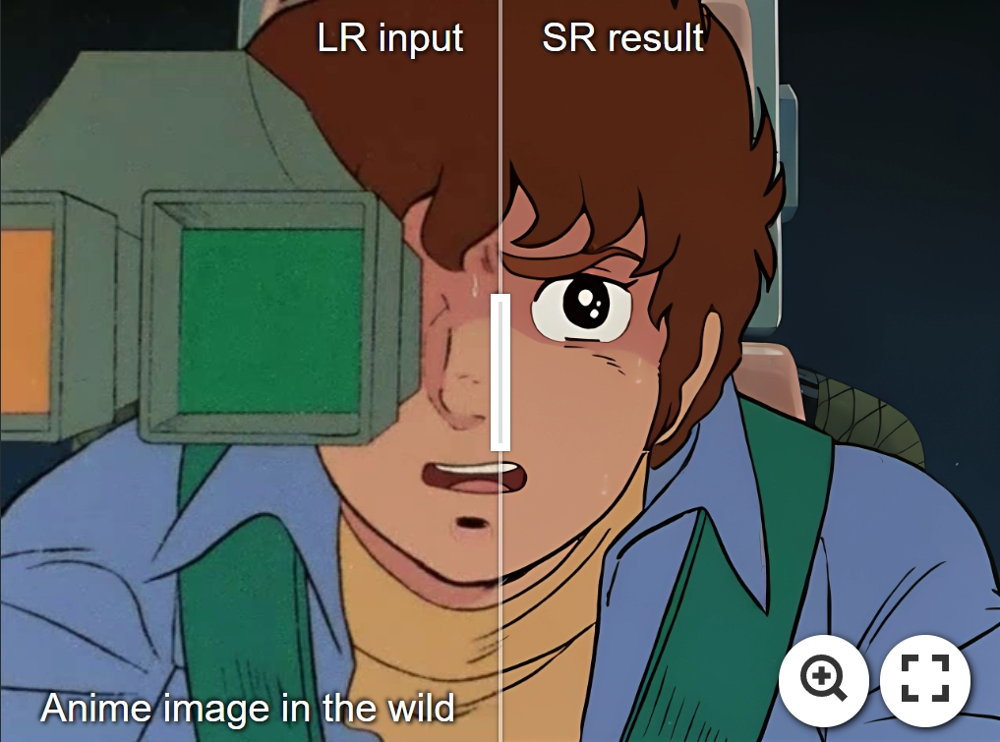
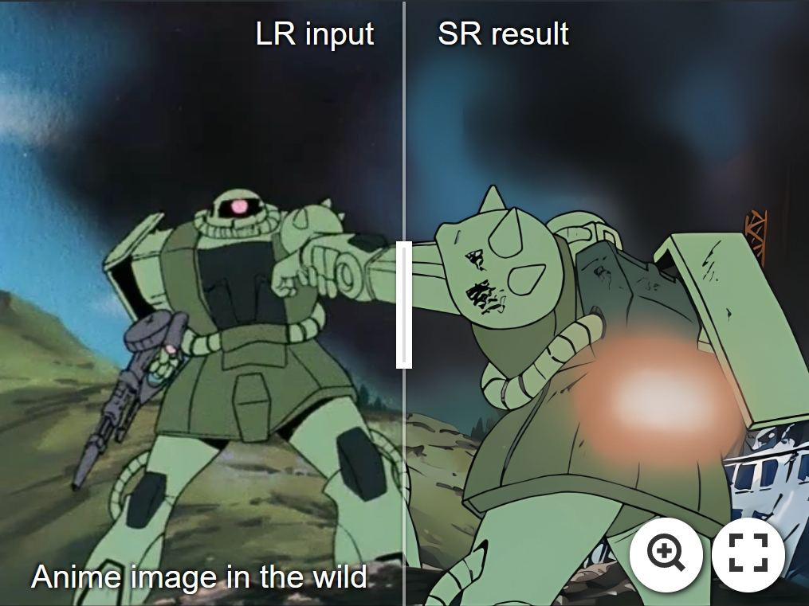
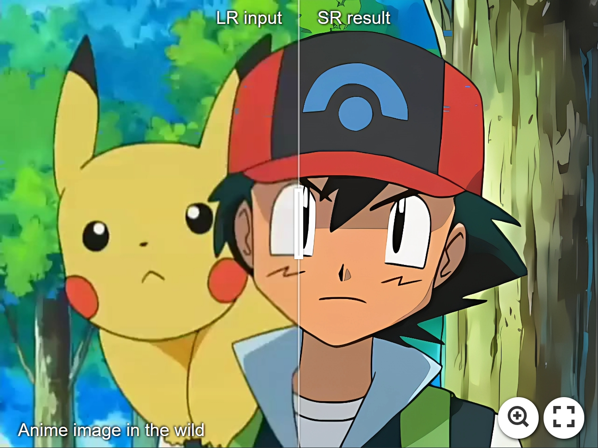
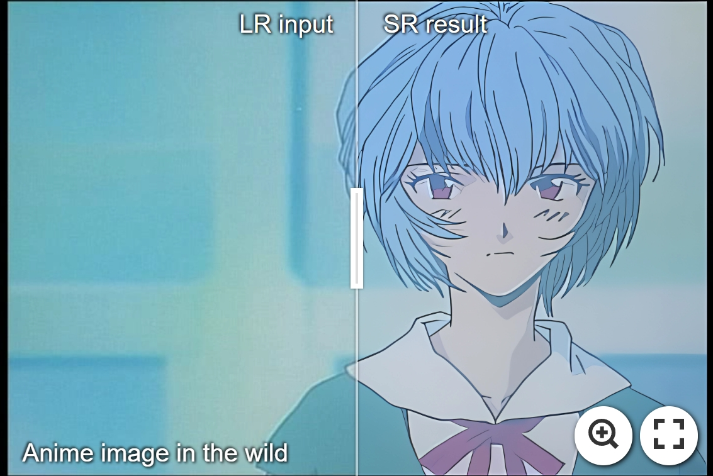
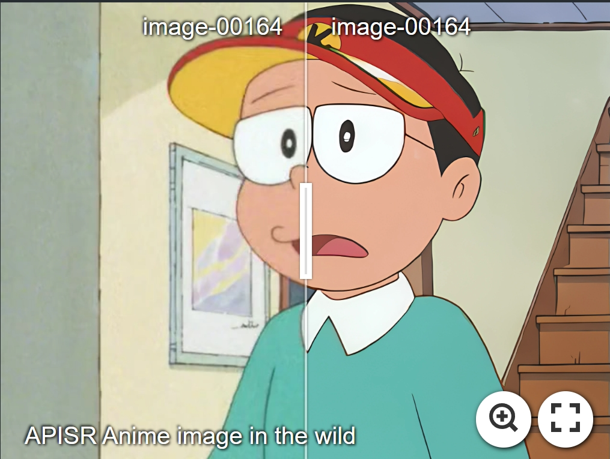
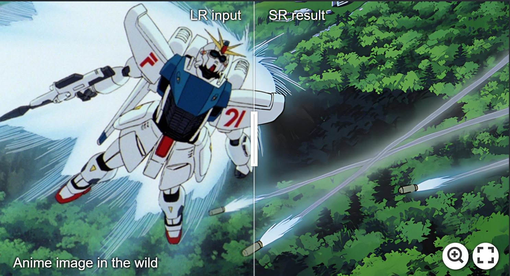
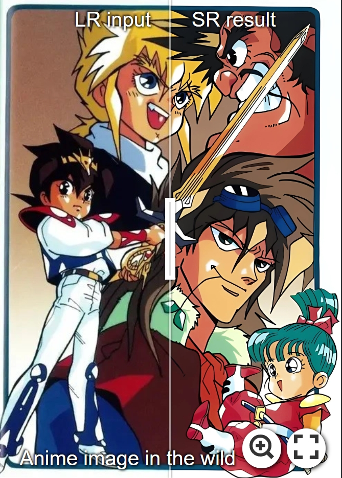
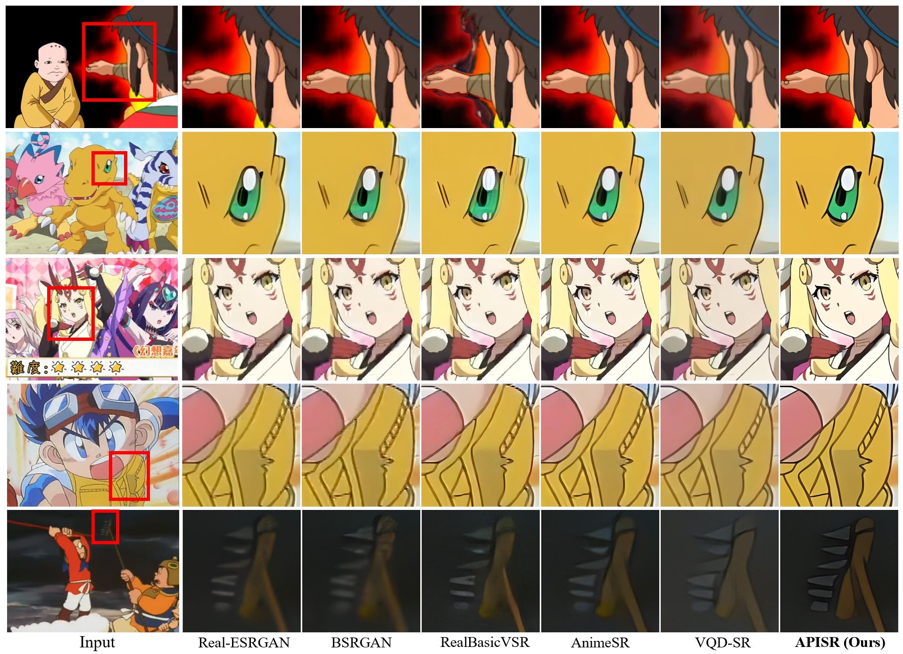

<p align="center">
    
</p>
## Video Test ##


https://github.com/YuLunQi/APISR/assets/150509226/f51ba716-36cd-4a1a-a6c4-cd2b4af0329c


## APISR: Anime Production Inspired Real-World Anime Super-Resolution (CVPR 2024)
APISR is an upscaler that aims at restoring and enhancing low-quality low-resolution anime images and video sources with various degradations from real-world scenarios. 
 


<p align="center">
    
</p>


<!---------------------------------------- Visualization ---------------------------------------->
## <a name="Visualization"></a> Visualization (Click them for the best view!) 

<!-- Kiteret: https://imgsli.com/MjQ1NzE0 -->
<!-- EVA: https://imgsli.com/MjQ1NzIx -->
<!-- Pokemon: https://imgsli.com/MjQ1NzIy -->
<!-- Pokemon2: https://imgsli.com/MjQ1NzM5 -->
<!-- Gundam0079: https://imgsli.com/MjQ1NzIz -->
<!-- Gundam0079 #2: https://imgsli.com/MjQ1NzMw -->
<!-- f91: https://imgsli.com/MjQ1NzMx -->
<!-- wataru: https://imgsli.com/MjQ1NzMy -->

[](https://imgsli.com/MjQ1NzIz) [](https://imgsli.com/MjQ1NzMw) 

[](https://imgsli.com/MjQ1NzIy) [](https://imgsli.com/MjQ1NzM5)

[](https://imgsli.com/MjQ1NzIx) [](https://imgsli.com/MjQ1NzE0) 

[](https://imgsli.com/MjQ1NzMx) [](https://imgsli.com/MjQ1NzMy)


<p align="center">
  
</p>
<!--------------------------------------------  --------------------------------------------------->


## <a name="installation"></a> Installation 

```shell
git clone git@github.com:Kiteretsu77/APISR.git
cd APISR

# Create conda env
conda create -n APISR python=3.10
conda activate APISR

# Install Pytorch and other packages needed
pip install torch==2.1.1 torchvision==0.16.1 torchaudio==2.1.1 --index-url https://download.pytorch.org/whl/cu118
pip install -r requirements.txt


# To be absolutely sure that the tensorboard can execute. I recommend the following CMD from "https://github.com/pytorch/pytorch/issues/22676#issuecomment-534882021"
pip uninstall tb-nightly tensorboard tensorflow-estimator tensorflow-gpu tf-estimator-nightly
pip install tensorflow

# Install FFMPEG [Only needed for training and dataset curation stage; inference only does not need ffmpeg] (the following is for the linux system, Windows users can download ffmpeg from https://ffmpeg.org/download.html)
sudo apt install ffmpeg
```


## <a name="inference"></a> Gradio Fast Inference 
Gradio option doesn't need to prepare the weight from the user side but they can only process one image each time.

Online demo can be found at https://huggingface.co/spaces/HikariDawn/APISR (HuggingFace) or https://colab.research.google.com/github/camenduru/APISR-jupyter/blob/main/APISR_jupyter.ipynb (Colab)

Local Gradio can be created by running the following:
```shell
python app.py
```

**Note:** Gradio is designed for fast inference, so we will automatically download existing weights and downsample to 720P to ease the VRAM consumption. For a full grounder inference, please check the regular inference section below.


## <a name="regular_inference"></a> Regular Inference 

1. Download the model weight from [**model zoo**](docs/model_zoo.md) and **put the weight to "pretrained" folder**.

2. Then, Execute
    ```shell
    python test_code/inference.py --input_dir XXX  --weight_path XXX  --store_dir XXX
    ```
    If the weight you download is paper weight, the default argument of test_code/inference.py is capable of executing sample images from "__assets__" folder


## <a name="dataset_curation"></a> Dataset Curation 
Our dataset curation pipeline is under **dataset_curation_pipeline** folder. 

You can collect your dataset by sending videos (mp4 or other format) into the pipeline and get the least compressed and the most informative images from the video sources. 

1.  Download [IC9600](https://github.com/tinglyfeng/IC9600?tab=readme-ov-file) weight (ck.pth) from https://drive.google.com/drive/folders/1N3FSS91e7FkJWUKqT96y_zcsG9CRuIJw and place it at "pretrained/" folder (else, you can define a different **--IC9600_pretrained_weight_path** in the following collect.py execution)

2.  With a folder with video sources, you can execute the following to get a basic dataset (with **ffmpeg** installed):

    ```shell
    python dataset_curation_pipeline/collect.py --video_folder_dir XXX --save_dir XXX
    ```

3. Once you get an image dataset with various aspect ratios and resolutions, you can run the following scripts

    Be careful to check **uncropped_hr** && **degrade_hr_dataset_path** && **train_hr_dataset_path** (we will use these path in **opt.py** setting during training stage)

    In order to decrease memory utilization and increase training efficiency, we pre-process all time-consuming pseudo-GT (**train_hr_dataset_path**) at the dataset preparation stage. 
    
    But, in order to create a natural input for prediction-oriented compression, in every epoch, the degradation started from the uncropped GT (**uncropped_hr**), and LR synthetic images are concurrently stored. The cropped HR GT dataset (**degrade_hr_dataset_path**) and cropped pseudo-GT (**train_hr_dataset_path**) are fixed in the dataset preparation stage and won't be modified during training.

    Be careful to check if there is any OOM. If there is, it will be impossible to get the correct dataset preparation. Usually, this is because **num_workers** in **scripts/anime_strong_usm.py** is too big!
    ```shell
    bash scripts/prepare_datasets.sh
    ```
    


## <a name="train"></a> Train 

**The whole training process can be done in one RTX3090/4090!**

1. Prepare a dataset ([AVC](https://github.com/TencentARC/AnimeSR?tab=readme-ov-file#request-for-avc-dataset) / API) that is preprocessed by STEP 2 & 3 in [**Dataset Curation**](#dataset_curation)

    In total, you will have 3 folders prepared before executing the following commands: 

    --> **uncropped_hr**: uncropped GT

    --> **degrade_hr_dataset_path**: cropped GT
    
    --> **train_hr_dataset_path**: cropped Pseudo-GT


2. Train: Please check **opt.py** carefully to set the hyperparameters you want (modifying **Frequently Changed Setting** is usually enough).

    **Note1**: When you execute the following, we will create a "**tmp**" folder to hold generated lr images for sanity check. You can modify the code to delete it if you want.

    **Note2**: If you have a strong CPU, and if you want to accelerate, you can increase **parallel_num** in the **opt.py**.
 
 
    **Step1** (Net **L1** loss training): Run 
    ```shell
    python train_code/train.py 
    ```
    The trained model weights will be inside the folder 'saved_models' (same as checkpoints)


    **Step2** (GAN **Adversarial** Training):
   
    1. Change opt['architecture'] in **opt.py** to "GRLGAN" and change **batch size** if you need. BTW, I don't think that, for personal training, it is needed to train 300K iter for GAN. I did that in order to follow the same setting as in AnimeSR and VQDSR, but **100K ~ 130K** should have a decent visual result.

    2. Following previous works, GAN should start from L1 loss pre-trained network, so please carry a **pretrained_path** (the default path below should be fine)
    ```shell
    python train_code/train.py --pretrained_path saved_models/grl_best_generator.pth 
    ```


